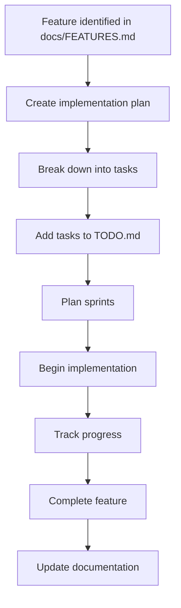
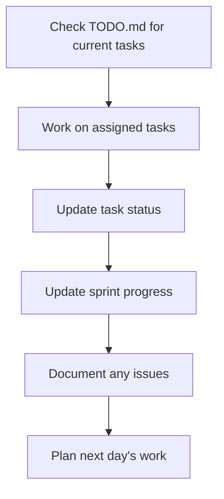

# Project Organization Summary

## Overview

We've implemented a comprehensive project management structure to organize implementation plans, track progress, and manage the development workflow systematically. This structure provides clear separation of concerns and makes it easier to manage the complex feature set of the LRE Manager project.

## New Structure

### 📋 **Feature Roadmap** (`docs/FEATURES.md`)
- **Purpose**: High-level feature planning and requirements
- **Content**: Feature descriptions, priorities, and completion status
- **Updates**: When new features are planned or requirements change
- **Status**: ✅ Already exists and well-maintained

### 📝 **Implementation Plans** (`docs/implementation-plans/`)
- **Purpose**: Detailed technical implementation plans for each major feature
- **Content**: Architecture, API design, UI/UX specifications, testing strategy
- **Updates**: Before starting implementation of a feature
- **Status**: ✅ New structure created with templates and examples

### ✅ **Task Tracking** (`TODO.md`)
- **Purpose**: Granular task management and progress tracking
- **Content**: Individual tasks, bugs, improvements with priority levels
- **Updates**: Daily during development
- **Status**: ✅ Already exists and well-maintained

### 🏃 **Sprint Planning** (`docs/sprints/`)
- **Purpose**: Time-boxed development cycles with specific deliverables
- **Content**: Sprint goals, tasks, acceptance criteria, retrospectives
- **Updates**: Every 2-4 weeks
- **Status**: ✅ New structure created with templates and examples

### 🚀 **Release Planning** (`docs/releases/`)
- **Purpose**: Version planning and release management
- **Content**: Release notes, feature summaries, deployment plans
- **Updates**: Before each release
- **Status**: ✅ Directory created, ready for use

### 📊 **Project Management** (`docs/PROJECT_MANAGEMENT.md`)
- **Purpose**: Overall project management workflow and guidelines
- **Content**: Templates, best practices, tracking methodologies
- **Updates**: As processes evolve
- **Status**: ✅ New comprehensive guide created

## Key Benefits

### **Clear Separation of Concerns**
- **Features**: High-level planning and requirements
- **Implementation**: Detailed technical plans
- **Tasks**: Granular execution tracking
- **Sprints**: Time-boxed delivery cycles
- **Releases**: Version management

### **Improved Planning**
- Detailed implementation plans before starting work
- Clear dependencies and risk assessment
- Realistic effort estimation
- Comprehensive testing strategies

### **Better Progress Tracking**
- Granular task tracking with priorities
- Sprint-based progress monitoring
- Clear success criteria and acceptance criteria
- Regular retrospectives and process improvement

### **Enhanced Communication**
- Standardized templates for consistency
- Clear documentation for stakeholders
- Regular progress reporting
- Transparent decision-making process

## How to Use the New Structure

### For New Features

 - **Check docs/FEATURES.md** for feature requirements and priority
 - **Create implementation plan** in `docs/implementation-plans/`
 - **Break down into tasks** and add to TODO.md
 - **Plan sprints** using `docs/sprints/` templates
 - **Track progress** using the established workflow

### For Ongoing Development

 - **Use TODO.md** for daily task tracking
 - **Follow sprint plans** for time-boxed delivery
 - **Update implementation plans** as work progresses
 - **Document lessons learned** in retrospectives
 - **Update docs/FEATURES.md** when features are completed

### For Project Management

 - **Use implementation plans** for resource allocation
 - **Track sprint velocity** and adjust estimates
 - **Identify risks early** and update mitigation strategies
 - **Coordinate dependencies** between features
 - **Plan releases** based on sprint completion

## Example Workflow

### Starting a New Feature

### Daily Development Workflow

## Templates and Standards

### Implementation Plan Template
- Standardized structure for all feature plans
- Clear sections for requirements, architecture, and testing
- Risk assessment and mitigation strategies
- Success criteria and acceptance criteria

### Sprint Planning Template
- Consistent sprint structure and format
- Clear backlog organization by priority
- Daily standup tracking
- Retrospective and metrics tracking

### Task Management Standards
- Priority levels (Critical, High, Medium, Low)
- Effort estimation using story points
- Clear acceptance criteria
- Dependencies and blockers tracking

## Migration from Current State

### What's Already Working
- ✅ docs/FEATURES.md is comprehensive and well-maintained
- ✅ TODO.md has good task tracking
- ✅ Existing documentation structure is solid

### What's New
- ✅ Implementation plans for detailed technical planning
- ✅ Sprint planning for time-boxed delivery
- ✅ Project management guidelines and templates
- ✅ Release planning structure

### What's Improved
- ✅ Better organization and separation of concerns
- ✅ Standardized templates and processes
- ✅ Enhanced progress tracking and reporting
- ✅ Clear workflow for feature development

## Next Steps

### Immediate Actions
 - **Review the new structure** and provide feedback
 - **Start using implementation plans** for the next feature
 - **Create a sprint plan** for the current development cycle
 - **Update existing documentation** to reference the new structure

### Ongoing Improvements
 - **Refine templates** based on usage and feedback
 - **Automate progress reporting** where possible
 - **Integrate with development tools** (GitHub Projects, etc.)
 - **Regular process reviews** and improvements

## Success Metrics

### Development Metrics
- **Planning Accuracy**: Implementation plans vs. actual effort
- **Sprint Velocity**: Story points completed per sprint
- **Task Completion Rate**: Tasks completed on time
- **Documentation Quality**: Completeness and accuracy

### Process Metrics
- **Feature Delivery Time**: From planning to completion
- **Bug Rate**: Bugs introduced vs. bugs fixed
- **Team Satisfaction**: Process effectiveness ratings
- **Stakeholder Satisfaction**: Communication and delivery quality

---

This new structure provides a solid foundation for managing the complex LRE Manager project while maintaining flexibility for future growth and changes. 